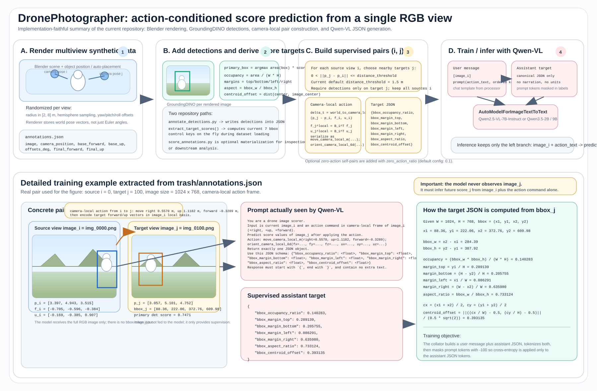
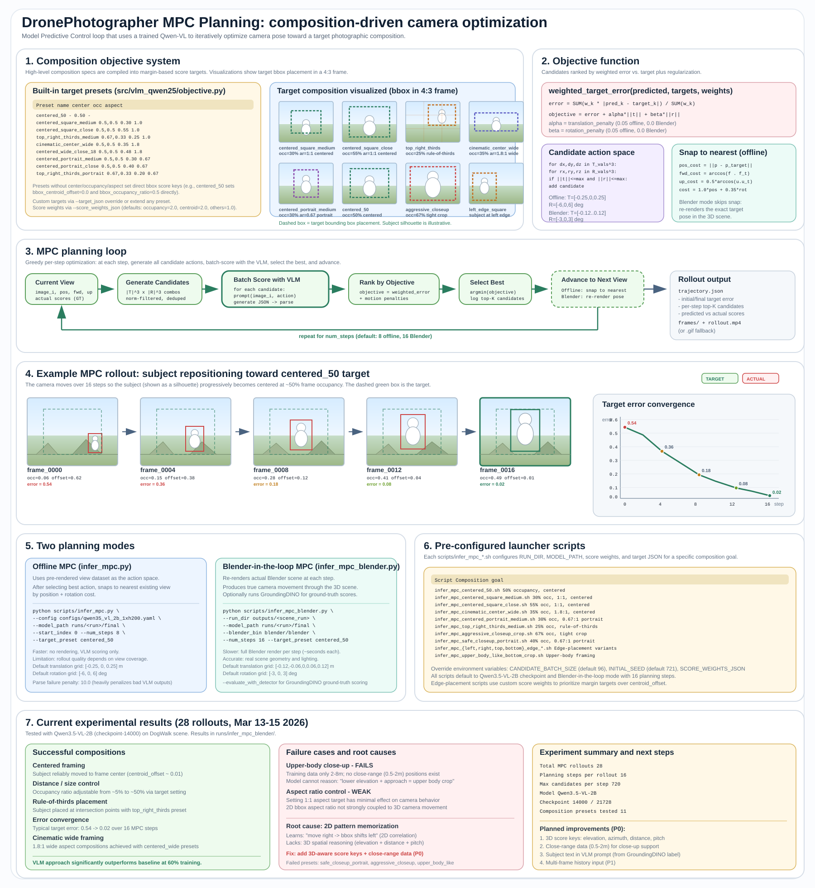

# DronePhotographer



DronePhotographer generates synthetic drone-camera views in Blender, annotates the rendered images with object detections, and trains a Qwen vision-language model to predict composition scores after a camera action.

The training task is:

- input: `image_i` + action text (`move` + target orientation)
- output: JSON score prediction for `image_j`

The current configs default to rule-based bbox controllability targets derived from GroundingDINO detections. The codebase also supports subject-aware score keys if those fields are added to the annotations.

## What Is In This Repo

- `render_object.py`: Blender rendering entry point. Produces RGB images, optional depth maps, `annotations.json`, and `run_info.json`.
- `src/detectors/detector.py`: GroundingDINO wrapper plus optional visualization helpers.
- `src/scoring/`: score extraction and normalization utilities.
- `src/vlm_qwen25/`: dataset construction, prompt formatting, rotation math, collator, JSON parsing, MPC planner, and composition objectives.
- `scripts/train.py`: Hugging Face `Trainer` entry point for Qwen image-text models.
- `scripts/eval_qwen25_vl.py`: offline evaluation with MAE/RMSE and JSON parse-failure tracking.
- `scripts/predict_qwen25_vl.py`: single-image prediction.
- `scripts/infer_mpc.py`: MPC-based camera planning using pre-rendered views.
- `scripts/infer_mpc_blender.py`: MPC planning with Blender re-rendering at each step.
- `scripts/infer_mpc_*.sh`: launcher scripts for specific composition presets.
- `configs/`: training configs for Qwen2.5-VL-7B plus Qwen3.5 2B and 9B variants.

## End-To-End Workflow

1. Render many single views around a subject with `render_object.py`.
2. Add detections to each rendered view with `scripts/annotate_detections.py`.
3. Optionally materialize `score_*` fields with `scripts/score_annotations.py`.
4. Build training pairs on the fly from nearby views:
   - source: `image_i`
   - action: relative pose from view `i` to view `j`
   - target: score JSON for `image_j`
5. Train or evaluate a Qwen model that generates the target JSON.
6. Plan optimal camera movements with `infer_mpc.py` or `infer_mpc_blender.py` using a trained model and a composition objective.

Important: the default training configs use `annotations_detected.json`, not `annotations_scored.json`. For rule-based bbox targets, the dataset recomputes scores from the stored detections at load time.

## Setup

### Python

Create an environment for training / scoring scripts and install:

```bash
python -m venv .venv
source .venv/bin/activate
pip install -r requirements.txt
```

`requirements.txt` expects a PyTorch-capable environment and includes:

- `torch`
- `transformers>=5.2.0`
- `qwen-vl-utils`
- `accelerate`
- `deepspeed`
- `tensorboard`
- `Pillow`, `numpy`, `PyYAML`, `tqdm`
- `opencv-python`, `supervision`, `matplotlib`, `pycocotools`

### GroundingDINO

Detection is optional for rendering, but required for the default training pipeline.

```bash
pip install --no-build-isolation -e ./repos/GroundingDINO
```

The detection scripts assume:

- config: `repos/GroundingDINO/groundingdino/config/GroundingDINO_SwinT_OGC.py`
- weights: `repos/GroundingDINO/weights/groundingdino_swint_ogc.pth`

### Blender And Assets

- The repo includes a local Blender binary at `blender/blender`.
- Scene assets referenced by the shell launchers are not stored in this repo.
- The bundled shell scripts currently point to workstation-specific scene paths under `/home/nas5/jungwooahn/datasets/DronePhotos/...`.

Override those paths with flags or environment variables before running the launcher scripts.

## Rendering

### Quick Smoke Test

```bash
bash scripts/smoke_render_object.sh
```

Supported environment overrides:

- `BLENDER_BIN`
- `SCENE_PATH`
- `OUTPUT_DIR`
- `NUM_IMAGES`
- `GPU_BACKEND`
- `GPU_DEVICES`

### Full Render Launcher

```bash
bash render_object.sh
```

This wrapper defaults to a 10k-image DogWalk render and writes a run directory under `outputs/`.

### Direct Blender Invocation

Use one of these subject selection modes:

- `--object_position x y z`
- `--object_name <scene_object_name>`
- `--auto_place_object --input_object <path>`

Selection precedence in the renderer is:

1. `--object_position`
2. `--auto_place_object`
3. `--object_name`

Example:

```bash
blender/blender -b -P render_object.py -- \
  --input_scene /abs/path/to/DogWalk.blend \
  --output_dir outputs \
  --run_name demo \
  --object_position -0.011 0.0364 0.8 \
  --num_images 200 \
  --gpu_backend OPTIX \
  --gpu_devices 6 7 \
  --camera_radius_range 2 8 \
  --hemisphere \
  --camera_direction_offsets 15 15 0 \
  --samples 32 \
  --adaptive_sampling --adaptive_threshold 0.02 \
  --max_bounces 2 --diffuse_bounces 1 --glossy_bounces 1 --transmission_bounces 1 \
  --persistent_data
```

Useful renderer features:

- RGB output is always written to `images/img_XXXX.png`.
- `--render_depth` also writes `depth/img_XXXX.(png|exr)`.
- `--gpu_backend` supports `AUTO`, `OPTIX`, or `CUDA`.
- `--auto_place_object` imports `.glb`, `.gltf`, `.fbx`, `.obj`, or `.blend` assets and ray-casts for a flat placement region.
- Camera intrinsics default to DJI Mini 5 Pro-like values:
  - focal length `24.0`
  - sensor width `12.8`
  - sensor height `9.6`
  - resolution `1024x768`

### Render Outputs

Each render run creates:

- `images/`
- optional `depth/`
- `annotations.json`
- `run_info.json`

`annotations.json` contains one record per rendered image. The base schema is:

```json
[
  {
    "image": "images/img_0000.png",
    "camera_position": [3.39, 4.94, 3.52],
    "radius": 6.56,
    "object_position": [-0.011, 0.0364, 0.8],
    "base_forward": [-0.5194, -0.7477, -0.4138],
    "base_up": [-0.2361, -0.3399, 0.9104],
    "offsets_deg": {"yaw": -4.6563, "pitch": 13.8792, "roll": 0.0},
    "final_forward": [-0.3124, -0.8689, -0.3840],
    "final_up": [-0.3020, -0.2924, 0.9074],
    "depth": "depth/img_0000.png"
  }
]
```

Later stages may add:

- `prompt`
- `detections`
- `score_<key>`

## Detection And Rule-Based Scoring

### Add Detections

```bash
python scripts/annotate_detections.py \
  --annotations_path outputs/DogWalk_v2_10k_260309_101152/annotations.json \
  --image_root outputs/DogWalk_v2_10k_260309_101152 \
  --caption "a white snowman" \
  --device cuda \
  --output_path outputs/DogWalk_v2_10k_260309_101152/annotations_detected.json
```

This appends:

- `prompt`
- `detections: [{"label": ..., "score": ..., "bbox_xyxy": [...]}]`

### Visualize Detections

```bash
python scripts/visualize_detections.py \
  --annotations_path outputs/DogWalk_v2_10k_260309_101152/annotations_detected.json \
  --image_root outputs/DogWalk_v2_10k_260309_101152 \
  --output_dir outputs/DogWalk_v2_10k_260309_101152/detection_viz \
  --limit 20
```

### Materialize Score Fields

```bash
python scripts/score_annotations.py \
  --annotations_path outputs/DogWalk_v2_10k_260309_101152/annotations_detected.json \
  --image_root outputs/DogWalk_v2_10k_260309_101152 \
  --output_path outputs/DogWalk_v2_10k_260309_101152/annotations_scored.json
```

This computes `score_*` fields from the primary detected box.

Current rule-based keys are:

- `bbox_occupancy_ratio`
- `bbox_margin_top`
- `bbox_margin_bottom`
- `bbox_margin_left`
- `bbox_margin_right`
- `bbox_aspect_ratio`
- `bbox_centroid_offset`

Notes:

- The primary box is chosen by `area * score` when detection scores are available.
- All rule-based keys except `bbox_aspect_ratio` are clamped to `[0, 1]`.
- If no detection exists, the rule-based score vector is all zeros.

## Score Families

Two score families are implemented.

### 1. Rule-Based BBox Controllability

This is the default path used by the provided configs. It only requires `detections` in the annotation file.

### 2. Subject-Aware Composition Scores

Supported subject-aware keys:

- `subject_dominance`
- `rule_of_thirds`
- `lead_room`
- `figure_ground_separation`
- `leading_lines`
- `avoiding_merges`
- `center_of_gravity`
- `clear_margins`

If you switch `data.target_score_keys` to subject-aware keys, the dataset expects matching fields such as `score_subject_dominance` to already exist in the annotation JSON. This repo includes the prompt builder, but does not include a batch subject-aware annotation script.

## Pair Construction And Action Format

Training pairs are not stored on disk. `DroneActionScoreDataset` builds them from the view annotations at load time.

Pair construction rules:

- views are paired when camera-position distance is `> 0` and `<= data.distance_threshold`
- target view `j` must contain detections
- `data.max_pairs_per_image` caps sampled neighbors per source image
- `data.zero_action_ratio` adds self-pairs `(i, i)` with a zero action
- `data.eval_ratio` splits the pair list into train and eval subsets

Action text is generated from the relative transform between view `i` and view `j`.
The default configs now use `data.rotation_representation: orientation_6d`, which encodes the target camera orientation with target `forward` and `up` vectors instead of an axis-angle rotvec.

Camera-local format:

```text
move_camera_local_m(right=0.2000, up=-0.1000, forward=0.0000); orient_camera_local_6d(fx=0.0000, fy=0.1000, fz=0.9950, ux=0.0000, uy=0.9950, uz=-0.1000)
```

World-frame format:

```text
move_world_m(x=0.2000, y=-0.1000, z=0.0000); orient_world_6d(fx=0.0000, fy=0.1000, fz=0.9950, ux=0.0000, uy=0.9950, uz=-0.1000)
```

Legacy option:

- `data.rotation_representation: rotvec` keeps the old `rotate_*_axis_angle_rad(rx, ry, rz)` format.

## Rotation Convention

- Camera local axes for commands are `+right`, `+up`, `+forward` where `+forward` means view direction.
- Stored `final_forward` and `final_up` vectors are world-frame unit vectors.
- Blender camera orientation follows local `+X = right`, `+Y = up`, `-Z = forward`.
- `data.action_frame` can be `camera_local` or `world`.
- `data.rotation_representation` can be `orientation_6d` or `rotvec`.
- The default configs use `camera_local`.

Use the consistency checker after rotation-related changes:

```bash
python scripts/check_rotation_consistency.py \
  --annotations_path outputs/DogWalk_v2_10k_260309_101152/annotations.json \
  --max_views 1000 \
  --pair_samples 500 \
  --strict
```

## Training

### Main Entry Point

```bash
python scripts/train.py --config configs/qwen25_vl_7b_full.yaml
```

Supported config sections:

- `model`
- `data`
- `training`

The provided configs are:

- `configs/qwen25_vl_7b_full.yaml`
- `configs/qwen25_vl_7b_2xh200.yaml`
- `configs/qwen35_vl_2b_1xh200.yaml`
- `configs/qwen35_vl_2b_4xa100_40g.yaml`
- `configs/qwen35_vl_9b_1xh200.yaml`
- `configs/qwen35_vl_9b_2xh200.yaml`

The default data settings in those configs currently point to:

- `outputs/DogWalk_v2_10k_260309_101152/annotations_detected.json`
- `outputs/DogWalk_v2_10k_260309_101152`

### Multi-GPU Launchers

Qwen2.5-VL on 2xH200:

```bash
bash scripts/train_qwen25_vl_2_h200.sh
```

Qwen3.5-2B on 1xH200:

```bash
bash scripts/train_qwen35_vl_2b_1_h200.sh
```

Qwen3.5-9B on 2xH200:

```bash
bash scripts/train_qwen35_vl_9b_2_h200.sh
```

Qwen3.5-9B on 1xH200:

```bash
bash scripts/train_qwen35_vl_9b_1_h200.sh
```

Useful overrides:

- `GPU_ID=4 bash scripts/train_qwen35_vl_2b_1_h200.sh`
- `GPU_ID=4 bash scripts/train_qwen35_vl_9b_1_h200.sh`
- `MASTER_PORT=29601 bash scripts/train_qwen25_vl_2_h200.sh`

The 2-GPU launcher scripts auto-pick a free `torchrun` master port when `MASTER_PORT` is unset.

### Training Outputs

Successful training writes a run directory like:

```text
runs/<timestamp>_<run_name>/
```

Expected contents:

- `config.yaml`
- `checkpoints/`
- `final/`
- `summary.json`

`summary.json` includes:

- total pair count
- train/eval pair counts
- total views
- zero-action pair count
- action frame
- rotation representation
- target score keys

## Evaluation

```bash
python scripts/eval_qwen25_vl.py \
  --config configs/qwen25_vl_7b_full.yaml \
  --model_path runs/<run_dir>/final
```

Outputs:

- report JSON at `runs/qwen25_vl_eval_report.json` by default
- per-key `mae`
- per-key `rmse`
- `parse_failure_rate`

If `data.eval_ratio > 0`, evaluation runs on that split. Otherwise the full dataset is used.

## Single Prediction

```bash
python scripts/predict_qwen25_vl.py \
  --model_path runs/<run_dir>/final \
  --image_path outputs/DogWalk_v2_10k_260309_101152/images/img_0000.png \
  --action_frame camera_local \
  --rotation_representation orientation_6d \
  --action_text "move_camera_local_m(right=0.2, up=-0.1, forward=0.0); orient_camera_local_6d(fx=0.0, fy=0.1, fz=0.9950, ux=0.0, uy=0.9950, uz=-0.1)"
```

The script prints:

- raw generated text
- score-key order
- parsed JSON scores when parsing succeeds

## MPC Camera Planning



Once a model is trained, MPC-based planning finds camera actions that optimize toward a target composition objective. Two planning modes are available.

### Offline MPC (Pre-Rendered Views)

`infer_mpc.py` generates candidate actions, scores them with the VLM, picks the best action, and snaps to the nearest pre-rendered view.

```bash
python scripts/infer_mpc.py \
  --config configs/qwen35_vl_2b_1xh200.yaml \
  --model_path runs/<run_dir>/final \
  --start_index 0 \
  --num_steps 8 \
  --target_preset centered_50
```

### Blender-In-The-Loop MPC

`infer_mpc_blender.py` re-renders in Blender at each planning step instead of snapping to existing views. This is slower but produces realistic rollouts.

```bash
python scripts/infer_mpc_blender.py \
  --run_dir outputs/DogWalk_v2_10k_260309_101152 \
  --model_path runs/<run_dir>/final \
  --config configs/qwen35_vl_2b_1xh200.yaml \
  --blender_bin blender/blender \
  --num_steps 16 \
  --target_preset centered_50
```

Pass `--evaluate_with_detector` to run GroundingDINO on each rendered frame and log actual bbox scores alongside VLM predictions.

### Composition Presets

Target presets define photographic composition goals using high-level parameters (`center_x`, `center_y`, `occupancy`, `aspect_ratio`) that are automatically converted into margin-based score targets.

List available presets:

```bash
python scripts/infer_mpc.py --list_target_presets
```

Built-in presets:

| Preset | Description |
|--------|-------------|
| `centered_50` | 50% occupancy, centered subject |
| `centered_square_medium` | 30% occupancy, 1:1 aspect, centered |
| `centered_square_close` | 55% occupancy, 1:1 aspect, centered |
| `centered_wide_18` | 1.8:1 wide format, centered |
| `centered_wide_close_18` | 48% occupancy, 1.8:1 wide, centered |
| `cinematic_center_wide` | 35% occupancy, 1.8:1 wide, centered |
| `centered_portrait_medium` | 30% occupancy, 0.67:1 portrait, centered |
| `centered_portrait_close` | 40% occupancy, 0.67:1 portrait, centered |
| `top_right_thirds_medium` | 25% occupancy, 1:1 aspect, rule-of-thirds placement |
| `top_right_thirds_portrait_medium` | 20% occupancy, 0.67:1 portrait, rule-of-thirds |

Use `--target_json` to pass a custom target instead of a preset:

```bash
python scripts/infer_mpc_blender.py \
  --run_dir outputs/DogWalk_v2_10k_260309_101152 \
  --model_path runs/<run_dir>/final \
  --target_json '{"bbox_occupancy_ratio":0.67,"bbox_margin_top":0.02,"bbox_margin_bottom":0.0,"bbox_margin_left":0.16,"bbox_margin_right":0.16,"bbox_aspect_ratio":0.69}'
```

Override per-key optimization weights with `--score_weights_json`:

```bash
--score_weights_json '{"bbox_occupancy_ratio":2.0,"bbox_centroid_offset":2.0}'
```

Default weights assign 2.0 to `bbox_occupancy_ratio` and `bbox_centroid_offset`, 1.0 to all others.

### MPC Launcher Scripts

Pre-configured shell scripts are provided for common composition goals:

```bash
bash scripts/infer_mpc_centered_50.sh
bash scripts/infer_mpc_cinematic_center_wide.sh
bash scripts/infer_mpc_top_right_thirds_medium.sh
bash scripts/infer_mpc_aggressive_closeup_crop.sh
# ... and more under scripts/infer_mpc_*.sh
```

Each script sets `RUN_DIR`, `MODEL_PATH`, score weights, and target JSON. Override environment variables before running:

- `CANDIDATE_BATCH_SIZE` (default: 96)
- `INITIAL_SEED` (default: 721)
- `SCORE_WEIGHTS_JSON`

### MPC Outputs

Each rollout writes to `runs/infer_mpc/` (or `runs/infer_mpc_blender/`):

```text
<timestamp>_mpc_rollout/
├── trajectory.json   # full rollout log: steps, candidates, scores, errors
├── frames/           # per-step frame images
└── rollout.mp4       # (or rollout.gif fallback)
```

`trajectory.json` includes initial and final target error, per-step top-K candidates with predicted scores, and snap cost for offline MPC.

### Key MPC Parameters

- `--num_steps`: number of planning steps (default: 8 offline, 16 Blender)
- `--translation_values_m`: discrete translation grid (CSV, default: `-0.25,0,0.25`)
- `--rotation_values_deg`: discrete rotation grid (CSV, default: `-6,0,6`)
- `--max_translation_norm_m`: filter out candidates exceeding this norm
- `--max_rotation_norm_deg`: filter out candidates exceeding this rotation
- `--translation_penalty_weight`: regularization on translation magnitude
- `--rotation_penalty_weight`: regularization on rotation magnitude
- `--parse_failure_penalty`: penalty for candidates where JSON parsing fails
- `--candidate_batch_size`: VLM batch size for scoring candidates

## Config Knobs That Matter

- `data.distance_threshold`: maximum source-target camera distance used to form a pair
- `data.max_pairs_per_image`: cap on neighbor samples per source image
- `data.zero_action_ratio`: fraction of no-op self-pairs added to the final dataset
- `data.target_score_keys`: output JSON keys and ordering
- `data.action_frame`: `camera_local` or `world`
- `data.rotation_representation`: `orientation_6d` or `rotvec`
- `training.max_length`: token budget for the image-text sequence
- `training.deepspeed_config`: optional ZeRO-3 config
- `training.resume_from_checkpoint`: resume path passed to the HF trainer

## Notes

- The model is trained as JSON generation, not regression heads.
- The collator masks prompt tokens and only trains on the assistant JSON response.
- `docs/figures/token_report_qwen25.json` contains a tokenization/debug snapshot for one sample.
- If Qwen3.5 loading fails, upgrade `transformers` in the training environment.
