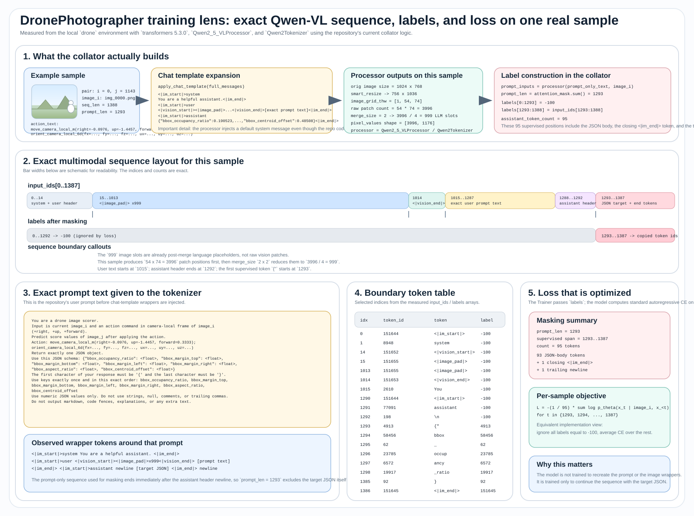

# DronePhotographer 미팅 (2026-03-19)

---

## 1. Overview

드론 카메라의 최적 구도를 자동으로 잡아주는 end-to-end 시스템.

**Pipeline**: Blender 렌더링 → Annotation → VLM 학습 → MPC-based Inference

---

## 2. Training

| 항목 | 내용 |
|------|------|
| Model | **Qwen3.5-VL-2B** |
| Training Data | 10,000 base views → **350,000 pairs** |
| Rotation | 3D Euler → **6D representation** (NN이 6D를 더 잘 학습) |
| GPU | 1 × H200, ~24hr |
| Task | 이미지 + 카메라 액션 → 7개 composition score (JSON) 예측 |

---

## 3. MPC Inference

- 매 step에서 720개 candidate action 생성
- VLM이 각 action 적용 후의 score 예측
- 목표에 가장 가까운 action 선택 → 반복 (16 steps)

---

## 4. Results

### 4.1 results visualized

| Run | Target | Error (f0→f15) | Best Step |
|-----|--------|----------------|-----------|
| 074407 | occupancy=0.5, 중앙 | 0.400 → 0.183 | 4 (0.132) |
| 074422 | center=(0.5,0.5), occ=0.3, aspect=1:1 | 0.249 → 0.127 | 8 (0.050) |
| 074438 | center=(0.67,0.33), occ=0.2, aspect=0.67 | 0.197 → 0.087 | 5 (0.072) |

### 4.2 results details

### 4.3 잘하는점

- **위치 제어**: 타겟 위치(중앙, 삼분점 등)를 설정하면 해당 위치로 잘 이동함
- **크기 제어**: occupancy 타겟에 따라 피사체 크기를 조절 가능 (큰 값 → 가까이, 작은 값 → 멀리)
- **복합 타겟 대응**: 위치 + 크기 + aspect ratio를 동시에 지정해도 대체로 수렴

> Run 1 vs 2: 동일 중앙 타겟이지만 occ=0.5(Run1)가 occ=0.3(Run2)보다 더 가까이 접근.
> Run 2: aspect=1:1 시도 — 약간 변화는 있으나 뚜렷하진 않음.
> Run 3: 삼분점 타겟으로 정상적으로 이동.

### 4.4 못하는점

| 한계 | 원인 |
|------|------|
| **상반신 클로즈업** | groundingdino 특성상 잘렸는지 알지는 못함 +근거리 데이터 부족 |
| **매우 가까운 촬영** | 근거리 데이터 수집 중 |
| **Aspect ratio 미세 제어** | 효과별로 |

모델은 **3D 기하 추론 없이 2D 패턴만 암기**하는 경향:

- **학습한 것**: "카메라 오른쪽 이동 → bbox 왼쪽 이동", "forward → occupancy 증가" 같은 2D 상관관계
- **못하는 것**: "정면 촬영을 위해 돌아가기", "elevation 낮추고 가까이 접근" 같은 3D spatial reasoning

현재 score (bbox 기반)만으로는 모델이 정면 구도를 잡을 유인이 없음 — 정수리에서 찍어도 bbox 점수가 비슷할 수 있어서 initial frame에 크게 의존하는듯

---

## 5. TODO

###
- [x] ~~GroundingDINO 의존 제거~~ → v3 렌더러에서 mask 기반 bbox로 대체 완료
- [ ] **Input target prompt** 추가 — VLM input에 타겟 composition을 텍스트로 넣기
- [ ] **Reference image 활용** — target 구도 어떻게 활용할지
### Photo Profile 확장
- [ ] **3D 정보 score 추가**: elevation, azimuth, camera pitch, truncation ratio 등 수치화
  - v3 렌더러에 이미 구현된 필드 활용 (`elevation_deg`, `azimuth_deg`, `camera_pitch_deg`, `visibility_ratio`)
  - 모델이 3D 정보를 고려하도록 유도

### Test-time Feedback
- [ ] **History/memory sequence**: 최근 몇 프레임을 함께 입력하고 reasoning 유도
  - e.g., "이렇게 했더니 너무 많이 갔으니 원래 방향으로 조금만 되돌아가자"
  - e.g., "뒷모습이니 반대편으로 이동 후 180도 회전, 거기서 재조정"

### 학습관련
- [ ] **여러 Scene으로 확장** 
- [ ] **Training technique 최적화** — zero-action, small action, large action 비율 조정
- [ ] **Close-range 데이터 수집** 

---

